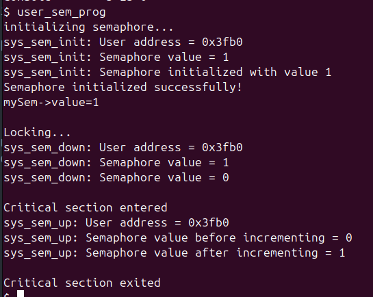

# Implementing mutex and semaphores in xv6:

## Significance:
xv6 already provides an implementation of locks using 'Spinlocks' which is good enough for simple locking tasks which involve locking shorter critical sections and controlling exclusive access to shared resources, without any count check (as done in counting semaphores) 

Spinlocks are very inefficient for longer critical sections as the threads/processes keep spinning to acquire the lock, (when lock is acquired by another process/thread) wasting CPU cycles.

In order to make locking in xv6 more efficient and be able to handle a larger context of locking problems involving count checks(like bounded-buffer problems), mutexes and semaphores can be implemented.

Mutex: Blocks the processes trying to acquire lock when locked instead of spinning. Used for mutual exclusion where only one process can execute its critical section at a time. Provides 'lock ownership': only the thread that acquires the lock can unlock it.
Binary semaphore: Similar to mutex, except for lock ownership: the thread which acquires the lock can be unlocked by any other thread also.
Counting semaphores: provide an extra counting control - allowing a certain number (limited number) of processes only to exclusively access the shared resource.

## Syntax:
1. Declaring:
```
struct sem mySem;
```
1. Initializing:
```
int sem_initialize(&mySem, value);
```
1. wait(P):
```
int sem_wait(&mySem);
```
1. signal(V):
```
sem_up(&mySem);
```


## Usage of semaphores:
```
	struct sem mySem;  // Declare a semaphore
    int value = 1;     // Initial value of the semaphore (you can choose based on your needs)
    // Initialize the semaphore
    printf("initializing semaphore...\n");
    if (sem_initialize(&mySem, value) < 0) {
        printf("Semaphore initialization failed\n");
        exit(1);
    }
    printf("Semaphore initialized successfully!\nmySem->value=%d\n\n",mySem.value);
    printf("Locking...\n");
    sem_down(&mySem);  // Acquire the semaphore (this will block if value is <= 0)
    printf("\nCritical section entered\n");
    sleep(1);
    sem_up(&mySem);  // Release the semaphore
    printf("\nCritical section exited\n");

```


#### Project by: Pranav Vijay Nadgir