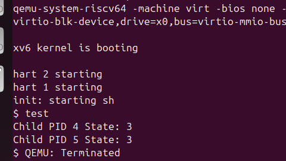

# System Call Implementation: `getprocstate`

## Overview
The `getprocstate` system call is designed to allow a parent process to query the states of its child processes. This feature is useful for debugging, monitoring, and understanding process lifecycle states.

---

## Implementation Details

### Kernel Modifications

**File: `proc.c`**
    - **Functionality**:
        - The `sys_getprocstate` function iterates through the process table to find child processes of the current process (`myproc`).
        - For each child process found, its state is printed using `printf`.
        - If no child processes exist, the function returns `-1`.
        - Locks (`acquire`/`release`) ensure safe access to process data.
    - **Code**:
      ```c
      int sys_getprocstate(void) {
          struct proc *parent_proc = myproc(); // Get current process
          if (parent_proc == 0) return -1;

          int parent_pid = parent_proc->pid;
          struct proc *p;
          int state;
          int found_child = 0;

          for (p = proc; p < &proc[NPROC]; p++) {
              acquire(&p->lock);
              if (p->parent != 0 && p->parent->pid == parent_pid) {
                  state = p->state;
                  release(&p->lock);
                  printf("Child PID %d State: %d\n", p->pid, state);
                  found_child = 1;
              } else {
                  release(&p->lock);
              }
          }

          if (!found_child) return -1; // No child found
          return 0;
      }
      ```

### Testing Environment

#### File: `test.c`
- A user program was written to test `getprocstate`.
- **Functionality**:
  - Creates two child processes using `fork`.
  - Parent process invokes `getprocstate` to print child process states.
  - Parent waits for child processes to finish.

- **Code**:
  ```c
  #include "./kernel/types.h"
  #include "user.h"

  int main(void) {
      int pid1, pid2;

      pid1 = fork();
      if (pid1 < 0) {
          printf("Fork failed!\n");
          exit(1);
      }
      if (pid1 == 0) {
          sleep(5);
          exit(1);
      }

      pid2 = fork();
      if (pid2 < 0) {
          printf("Fork failed!\n");
          exit(1);
      }
      if (pid2 == 0) {
          sleep(5);
          exit(1);
      }

      getprocstate();
      wait(0);
      wait(0);

      exit(1);
  }
   ```


---

## Testing and Results

1. **Expected Behavior**:
    - `getprocstate` prints the states of child processes. For example:
      ```
      Child PID 4 State: 5
      Child PID 5 State: 3
      ```
    - Returns `0` if child processes are found, `-1` otherwise.

2. **Test Output**:
    - After running the test program, the states of the child processes were printed as expected, confirming correct functionality.
    
---

## Conclusion

The `getprocstate` system call was successfully implemented. It integrates seamlessly into the kernel and provides a robust way for parent processes to monitor their child processes. Proper synchronization ensures safe access to process data, making it reliable and efficient.
