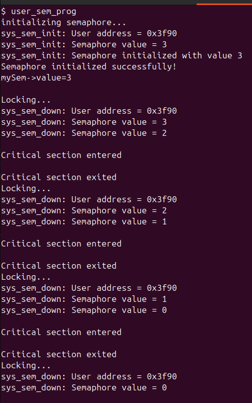

# Implementing mutex and semaphores in xv6:

## Significance:
xv6 already provides an implementation of locks using 'Spinlocks' which is good enough for simple locking tasks which involve locking shorter critical sections and controlling exclusive access to shared resources, without any count check (as done in counting semaphores) 

Spinlocks are very inefficient for longer critical sections as the threads/processes keep spinning to acquire the lock, (when lock is acquired by another process/thread) wasting CPU cycles.

In order to make locking in xv6 more efficient and be able to handle a larger context of locking problems involving count checks(like bounded-buffer problems), mutexes and semaphores can be implemented.

Mutex: Blocks the processes trying to acquire lock when locked instead of spinning. Used for mutual exclusion where only one process can execute its critical section at a time. Provides 'lock ownership': only the thread that acquires the lock can unlock it.
Binary semaphore: Similar to mutex, except for lock ownership: the thread which acquires the lock can be unlocked by any other thread also.
Counting semaphores: provide an extra counting control - allowing a certain number (limited number) of processes only to exclusively access the shared resource.

## Syntax:
1. Declaring:
```
struct sem mySem;
```
1. Initializing:
```
int sem_initialize(&mySem, value);
```
1. wait(P):
```
int sem_wait(&mySem);
```
1. signal(V):
```
sem_up(&mySem);
```


## Usage of semaphores:
### Using as a mutex lock:
```
	struct sem mySem;  // Declare a semaphore
    int value = 1;     // Initial value of the semaphore (you can choose based on your needs)
    // Initialize the semaphore
    printf("initializing semaphore...\n");
    if (sem_initialize(&mySem, value) < 0) {
        printf("Semaphore initialization failed\n");
        exit(1);
    }
    printf("Semaphore initialized successfully!\nmySem->value=%d\n\n",mySem.value);
    printf("Locking...\n");
    sem_down(&mySem);  // Acquire the semaphore (this will block if value is <= 0)
    printf("\nCritical section entered\n");
    sleep(1);
    sem_up(&mySem);  // Release the semaphore
    printf("\nCritical section exited\n");

```


### Counting action of semaphore:
```
    int value = 3;     // Initial value of the semaphore (you can choose based on your needs)

    // Initialize the semaphore
    printf("initializing semaphore...\n");
    if (sem_initialize(&mySem, value) < 0) {
        printf("Semaphore initialization failed\n");
        exit(1);
    }
    printf("Semaphore initialized successfully!\nmySem->value=%d\n\n",mySem.value);
    while(1){
    printf("Locking...\n");
    sem_down(&mySem);  // Acquire the semaphore (this will block if value is <= 0)
    printf("\nCritical section entered\n");
    sleep(1);
    //sem_up(&mySem);  // Release the semaphore
    printf("\nCritical section exited\n");
}
```


### Project by: Pranav Vijay Nadgir


# System Call Implementation: `getprocstate`

## Overview
The `getprocstate` system call is designed to allow a parent process to query the states of its child processes. This feature is useful for debugging, monitoring, and understanding process lifecycle states.

---

## Implementation Details

### Kernel Modifications

**File: `proc.c`**
    - **Functionality**:
        - The `sys_getprocstate` function iterates through the process table to find child processes of the current process (`myproc`).
        - For each child process found, its state is printed using `printf`.
        - If no child processes exist, the function returns `-1`.
        - Locks (`acquire`/`release`) ensure safe access to process data.
    - **Code**:
      ```c
      int sys_getprocstate(void) {
          struct proc *parent_proc = myproc(); // Get current process
          if (parent_proc == 0) return -1;

          int parent_pid = parent_proc->pid;
          struct proc *p;
          int state;
          int found_child = 0;

          for (p = proc; p < &proc[NPROC]; p++) {
              acquire(&p->lock);
              if (p->parent != 0 && p->parent->pid == parent_pid) {
                  state = p->state;
                  release(&p->lock);
                  printf("Child PID %d State: %d\n", p->pid, state);
                  found_child = 1;
              } else {
                  release(&p->lock);
              }
          }

          if (!found_child) return -1; // No child found
          return 0;
      }
      ```

### Testing Environment

#### File: `test.c`
- A user program was written to test `getprocstate`.
- **Functionality**:
  - Creates two child processes using `fork`.
  - Parent process invokes `getprocstate` to print child process states.
  - Parent waits for child processes to finish.

- **Code**:
  ```c
  #include "./kernel/types.h"
  #include "user.h"

  int main(void) {
      int pid1, pid2;

      pid1 = fork();
      if (pid1 < 0) {
          printf("Fork failed!\n");
          exit(1);
      }
      if (pid1 == 0) {
          sleep(5);
          exit(1);
      }

      pid2 = fork();
      if (pid2 < 0) {
          printf("Fork failed!\n");
          exit(1);
      }
      if (pid2 == 0) {
          sleep(5);
          exit(1);
      }

      getprocstate();
      wait(0);
      wait(0);

      exit(1);
  }
   ```


---

## Testing and Results

1. **Expected Behavior**:
    - `getprocstate` prints the states of child processes. For example:
      ```
      Child PID 4 State: 5
      Child PID 5 State: 3
      ```
    - Returns `0` if child processes are found, `-1` otherwise.

2. **Test Output**:
    - After running the test program, the states of the child processes were printed as expected, confirming correct functionality.
    
---

## Conclusion

The `getprocstate` system call was successfully implemented. It integrates seamlessly into the kernel and provides a robust way for parent processes to monitor their child processes. Proper synchronization ensures safe access to process data, making it reliable and efficient.

