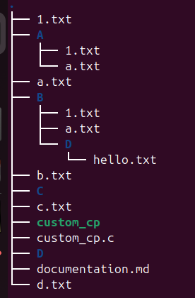
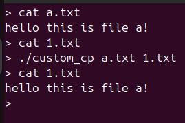
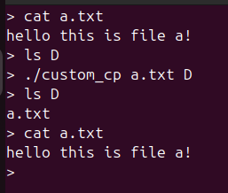
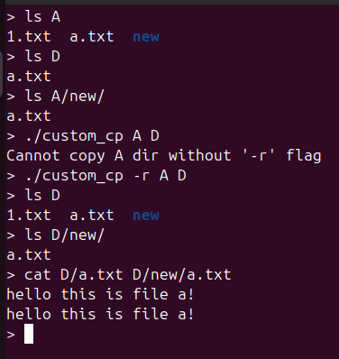
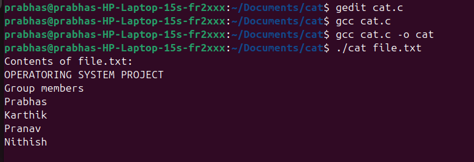
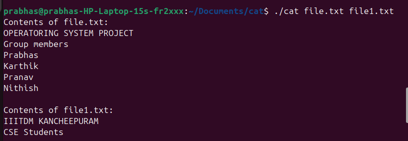
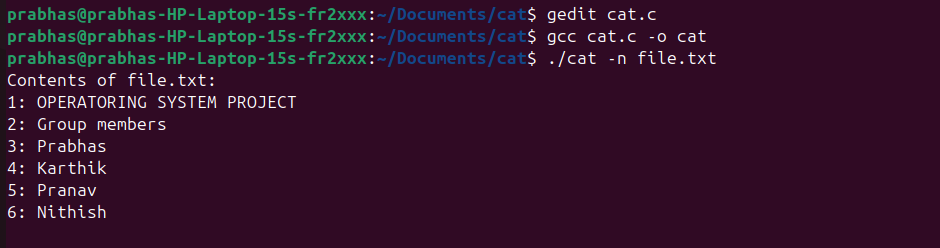

## custom_cp command:
### Usage: ```custom_cp [-r] src dest```
#### Functionalities:
* file to file copy
* file to folder copy(creates a new file at the folder with same name and contents)
* folder to folder copy(use -r: recursively copies all subdirs and files from src to dest dir)

Example:\
##### initial tree structure of the root dir


##### file-to-file copy demo

 - In this demo, two files a.txt and 1.txt exist in the root dir
 - a.txt has some text and 1.txt is empty
 - contents of a.txt is then copied to 1.txt as shown

##### file-to-folder copy demo

 - In this demo, a file a.txt and an empty folder D exist in the root dir
 - a.txt has some text and D is an empty sub-dir
 - a.txt is then copied to D as shown

##### folder-to-folder copy demo

 - In this demo, two folders A and D exist in the root dir
 - A has 2 files and a sub-dir
 - D has a file which is also in A
 - '-r' flag is necessary for dir to dir copy
 - contents of A is then recursively copied to D as shown

 custom_cat commands:
Usage custom_cat [-n] filename

Functionalities:

1. View File Content:
   Display the contents of one or more files to standard output (console).
   Example: cat file.txt
   

2. Concatenate Files:
   Combine multiple files and display their combined content.
   Example: cat file1.txt file2.txt > merged.txt. 
   file1.txt and file2.txt both text files are merged and printing output.  
   

3. Number Lines in Output:
   Display line numbers in the output.  
   Example: cat -n file.txt.  
   